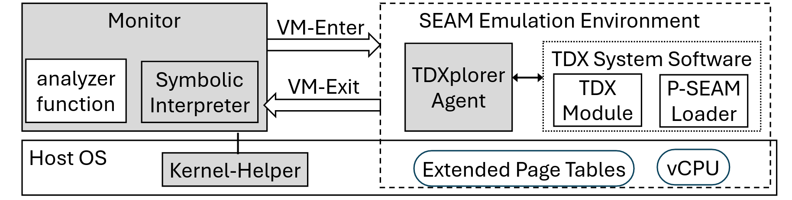

# TDXplorer – Intel TDX Emulation and Analysis Framework

TDXplorer is a framework to **execute and analyze the Intel TDX Module**, the software TCB of Intel TDX, **without requiring TDX hardware**.  
It enables **systems-level dynamic analysis** and **symbolic execution** of the TDX Module, offering runtime introspection and precise binary-level control.

---

## Why TDX Emulation Is Challenging

TDXplorer must overcome challenges unique to the Intel TDX Module:

1. **Execution-faithful environment** – The Module must run as if on real TDX hardware, requiring hardware features (e.g., continuous physical memory, live MMU updates) and correct system states (e.g., TDs for SEAM calls, secure EPT pages).  
2. **Event-faithful behavior** – The environment must reproduce hardware exceptions caused by invalid operations (e.g., unconfigured MK-TME Key-ID writes).  
3. **Runtime control** – The Module executes with Ring 0 and SEAM root privileges, making it difficult to introspect, control execution, and save/restore state for symbolic analysis.  

**For a full technical description, please refer to our paper(CCS 2025).**  
📄 [TDXplorer Paper (PDF)](TDXplorer-ccs25.pdf)

---

## Key Features
- Run the TDX Module on a desktop PC with **no hardware dependency**.
- Support for a wide variety of API calls:
  - **SEAM calls** from the VMM.
  - **TD calls** from guest VMs (TDs).
- Traditional dynamic analysis:
  - Software and hardware breakpoints (INT3, DR breakpoints).
  - Single stepping.
- Instruction and basic block tracing.
- Symbolic execution for in-depth analysis (via interpreter and constraint solving).

---

## TDXplorer Architecture

**Components:**
- **SEAM Environment**  
  Natively runs the TDX Module on host hardware, with required emulation support from the TDXplorer agent.  

- **Monitor**  
  Sets up the emulation environment for TDX Module execution and manages runtime state.  

    - **Interpreter**  
  Provides instruction interpretation support for symbolic execution. Built on the **Dyninst framework** and the **Z3 constraint solver**.  

    - **Analyzer Function**  
  User-programmable monitor/interpreter functions that allow analysts to control and customize the analysis task.  

- **Kernel Helper**  
  A host kernel module that exposes a custom IOCTL interface and provides the kernel-level support required by the Monitor.  

---

