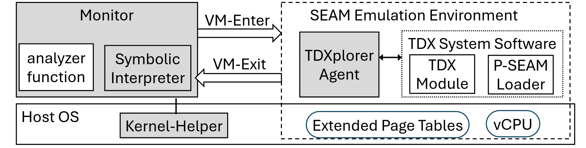

# TDXplorer – Intel TDX Emulation and Analysis Framework

TDXplorer is a framework to **execute and analyze the Intel TDX Module**, the software TCB of Intel TDX, **without requiring TDX hardware**.  
It enables **systems-level dynamic analysis** and **symbolic execution** of the TDX Module, offering runtime introspection and precise binary-level control.

---

## Why TDX Emulation Is Challenging

TDXplorer must overcome challenges unique to the Intel TDX Module:

1. **Execution-faithful environment** – The Module must run as if on real TDX hardware, requiring hardware features (e.g., continuous physical memory, live MMU updates) and correct system states (e.g., TDs for SEAM calls, secure EPT pages).  
2. **Event-faithful behavior** – The environment must reproduce hardware exceptions caused by invalid operations (e.g., unconfigured MK-TME Key-ID writes).  
3. **Runtime control** – The Module executes with Ring 0 and SEAM root privileges, making it difficult to introspect, control execution, and save/restore state for symbolic analysis.  

**For a full technical description, please refer to our paper(CCS 2025).**  
📄 [TDXplorer Paper (PDF)](TDXplorer-ccs25-long-version.pdf)

---

## Key Features
- Run the TDX Module on a desktop PC with **no hardware dependency**.
- Support for a wide variety of API calls:
  - **SEAM calls** from the VMM.
  - **TD calls** from guest VMs (TDs).
- Traditional dynamic analysis:
  - Software and hardware breakpoints (INT3, DR breakpoints).
  - Single stepping.
- Instruction and basic block tracing.
- Symbolic execution for in-depth analysis (via interpreter and constraint solving).

---

## TDXplorer Architecture



**Components:**
- **SEAM Environment**  
  Natively runs the TDX Module on host hardware, with required emulation support from the TDXplorer agent.  

- **Monitor**  
  Sets up the emulation environment for TDX Module execution and manages runtime state.  

    - **Interpreter**  
  Provides instruction interpretation support for symbolic execution. Built on the **Dyninst framework** and the **Z3 constraint solver**.  

    - **Analyzer Function**  
  User-programmable monitor/interpreter functions that allow analysts to control and customize the analysis task.  

- **Kernel Helper**  
  A host kernel module that exposes a custom IOCTL interface and provides the kernel-level support required by the Monitor.  

---

# Building TDXplorer


## 1. Platform Requirements


- **OS:** Ubuntu 22/24 (TDXplorer runs on the host)

- **Kernel Version:** 5.15.0 (TDXplorer has been tested with this Linux kernel version; other versions may work in theory)

- **CPU:** Intel CPU with VT-x hardware virtualization to run a VM

- **Note:** TDXplorer Monitor runs as a host-side user-space application and relies on a host kernel module (KM) for support.


**Note:** We expect the CPU to support `MOVDIR64B` and `XGETBV` instructions. However, TDXplorer automatically checks for these. If the CPU does not support them, TDXplorer can emulate these instructions as part of SEAM software execution in the SEAM emulation environment. This is configured by turning on the emulation configs in `TDXplorer/Monitor/include/user_configs.h`:


```c

/* system configurations: 0 = off, 1 = on */

#define MOVDIR64B_EMULATION 1

#define XGETBV_EMULATION 1

```


**Note:** KernelHelper is built separately as a Linux Kernel Module (LKM). Interpreter is a separate C++ program (mostly) built as a shared library. Monitor is a separate C program. Interpreter and Monitor share some headers, so always build Interpreter first and then build Monitor.


**Directory Structure:** Download the TDXplorer directory. Ensure the internal directory structure of TDXplorer is preserved.


## 2. Building KernelHelper


### Instructions


1. Keep the kernel log open in `tail` mode in another terminal tab.

2. Build the LKM:

   ```bash

   make clean

   make

   ```

3. Install the LKM:

   ```bash

   ./insmod.sh

   ```


### Expected Kernel Log Output


```

kernel_agent: CONFIG_PAGE_TABLE_ISOLATION is enabled.

kernel_agent: PTI is turned on.

kernel_agent: kernel_agent loaded

```


## 3. Building Interpreter


Interpreter requires Dyninst (for binary disassembly and instruction passing) and Z3 (for constraint evaluation and solving).


### Build Dyninst


1. `git clone https://github.com/dyninst/dyninst.git`

2. `cd dyninst`

3. `git checkout -b V12 v12.0.0`

4. `cd ..`

5. `mkdir dyninst_build && cd dyninst_build`

6. `cmake ../dyninst -DCMAKE_INSTALL_PREFIX=`pwd`/../install -DSTERILE_BUILD=OFF`

7. `make -j`nproc``

8. `make install`


### Build Z3


Download and install Microsoft Z3 version 4.8.14. Follow the instructions provided by the Z3 team: https://github.com/Z3Prover/z3/tree/z3-4.8.14


### Build Interpreter


1. Update the Makefile:

   - Update `DYNINST_PATH` at the specified line. Use the absolute path, e.g., `/home/dyninst/install`.

   - Update `Z3_PATH` at line 5. Use the absolute path, e.g., `/home/z3/z3-solver/z3`.


2. Run the build script:

   ```bash

   ./build-Interpreter.sh

   ```


3. Verify that `libinterpreter.so` is generated inside the `Interpreter` directory.


**Note:** Users can program `Analyze.cpp` (the analyzer function of the Interpreter lies in this file) for various symbolic analysis tasks. The `Analyze.cpp` version provided after a fresh TDXplorer download is sufficient for all experiments in *paper-section-7*. Two separate `Analyze.cpp` files are provided for experiments in paper-section-8.


Next, proceed to build the Monitor.


## 4. Build Monitor


Once the Interpreter has been successfully built, proceed to build the Monitor.


1. Build Monitor by running:

   ```bash

   ./build.sh

   ```


2. After a successful build, the TDXplorer binary `seam_manager` is created in the `Monitor` directory.


# Running TDXplorer

## Testing Currently supported SEAM/TD calls

Here we provide instructions to use TDXplorer as a TDX emulation platform and test different SEAM/TD calls by natively executing them.


### Testing all supported SEAM and TD calls except `TDH_SERVTD_PRE_BIND`


1. Update `user_configs.h` with contents from `Results/sec-7.2-functional-coverage/user_configs.h-all-but-servtd-prebind`.

2. Follow the TDXplorer build sequences from the [Build Interpreter](#build-interpreter) and [Build Monitor](#build-monitor) sections.

3. Run TDXplorer to get the execution trace and SEAM/TD call returned GPR state for each supported SEAM/TD call.

4. Check execution trace that shows TDX Module installation, TDX Module initialization, creation/building of 2 TDs and issuing various SEAM/TD calls.

### Testing `TDH_SERVTD_PRE_BIND`


1. Update `user_configs.h` with contents from `Results/sec-7.2-functional-coverage/user_configs.h-servtd-prebind-only`.

2. Follow the TDXplorer build sequences from the [Build Interpreter](#build-interpreter) and [Build Monitor](#build-monitor) sections.

3. Run TDXplorer to get the execution trace and SEAM/TD call returned GPR state for this SEAM call.


## Symbolic Execution

- Use the unmodified analyzer functions and the `user_configs.h` in the freshly downloaded TDXplorer. Rebuild.

- Run the script `./run.sh` in the Monitor directory.

- The command line will prompt:
  > "enter the TDX call number:"

  - To run a SEAM call: enter `s<SEAM call number>`  
    Example: To run `TDH_VP_RD`, enter `"s26"`.
  - To run a TD call: enter `t<TD call number>`  
    Example: To run `TDG_MEM_PAGE_ATTR_RD`, enter `"t23"`.

- Now move on to testing individual SEAM/TD calls supported by TDXplorer as follows.

Note: Monitor/seamManager/analyzer.c and Interlreter/Analyze.cpp can be modified for analysis tasks. A set of sample analyzer functions and different use cases will be uploaded soon.


